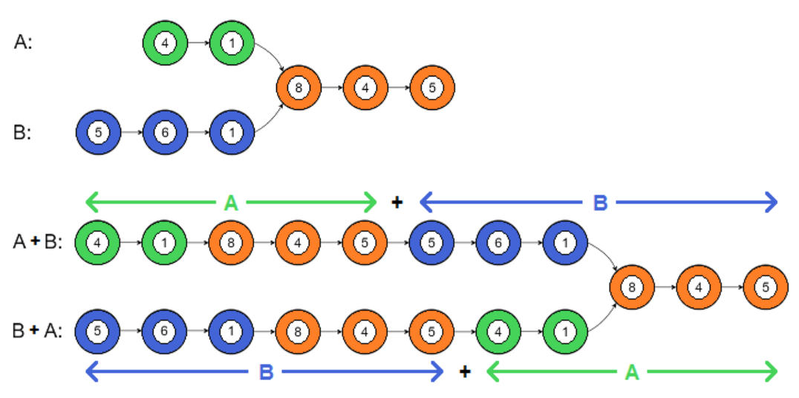

https://leetcode.com/problems/intersection-of-two-linked-lists/discuss/1092898/JS-Python-Java-C%2B%2B-or-Easy-O(1)-Extra-Space-Solution-w-Visual-Explanation

Idea:
The naive approach here would be to store each node reference in a data structure until we saw the same one twice, but that would take O(N) extra space.

In order to solve this problem with only O(1) extra space, we'll need to find another way to align the two linked lists. More importantly, we need to find a way to line up the ends of the two lists. And the easiest way to do that is to concatenate them in opposite orders, A+B and B+A. This way, the ends of the two original lists will align on the second half of each merged list.





Then we just need to check if at some point the two merged lists are pointing to the same node. In fact, even if the two merged lists don't intersect, the value of a and b will be the same (null) when we come to the end of the merged lists, so we can use that as our exit condition.

We just need to make sure to string headB onto a and vice versa if one (but not both) list ends.

```python
class Solution:
    def getIntersectionNode(self, headA: ListNode, headB: ListNode) -> ListNode:
        a, b = headA, headB
        while (a != b):
            a = a.next if a else headB
            b = b.next if b else headA
        return a
```


