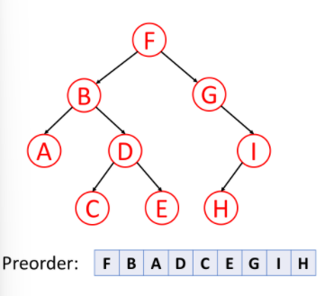
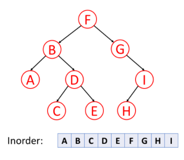
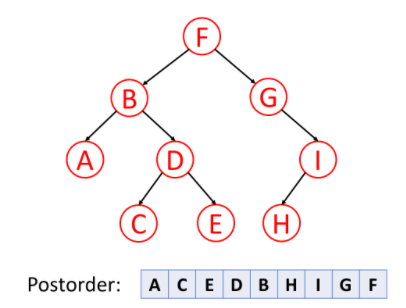

YouTube: Binary Tree in Python: Introduction and Traversal Algorithms
https://www.youtube.com/watch?v=6oL-0TdVy28&list=RDCMUCFxcvyt2Ucq5IL0_1Njzqlg&start_radio=1&rv=6oL-0TdVy28&t=55

## Binary tree traversals
Tree traversal: process of visiting (checking and/or updating) each node in a tree data structure, exactly once.

Unlike linked lists, one-dementional arrays etc., which are canonically traversed in linear order, trees may be traversed in multiple ways. They may be traversed in depth-first or breadth-first order.

There are three common ways to traverse them in depth-first order: in-order, pre-order, and post-order.

### Pre-order traversal
1. check if current node is empty/null

https://leetcode.com/explore/learn/card/data-structure-tree/134/traverse-a-tree/992/

