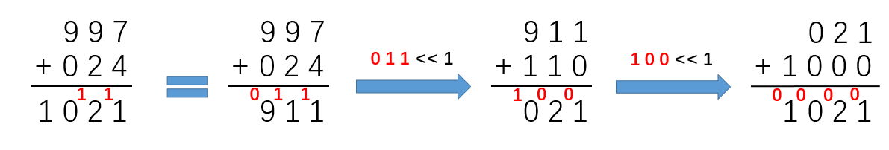

https://blog.csdn.net/fuxuemingzhu/article/details/79379939

0 + 0 = 0
1 + 0 = 1
0 + 1 = 1
1 + 1 = 0 (with carry)

XOR 的一个重要特性是不进位加法，那么只要再找到进位，将其和 XOR 的结果加起来，就是最后的答案。
通过观察上面的四种情况我们可以发现，只有在两个加数的值都是 1 的时候才会产生进位，所以我们采用 & 来计算进位的情况，
但是注意到由于是进位，所以我们必须要将 & 的结果左移一位，然后再和 XOR 的结果相加。

这个题的做法就是用 a 保存“直接加”（不考虑进位）的结果，用 b 保存进位；然后使 a 再与 b 相加，直至保存进位的 b 为 0.

“直接加”通过 XOR 实现，进位通过 and 实现。

